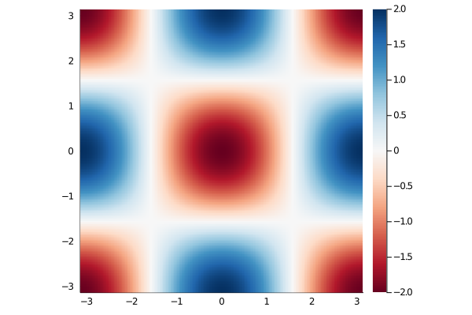
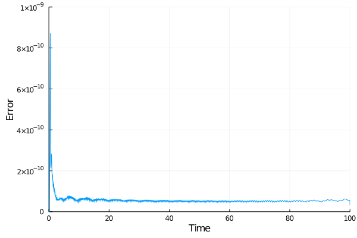

# NS2D

<!--

 -->

## Overview

NS2D is a simple pseudo-spectral solver for the two-dimensional Navier-Stokes equations in a doubly periodic domain written in Julia.
Its aim is primarily to get myself familiar with the Julia ecosystem for scientific computing as well as illustrating how pseudo-spectral solvers work for my students.
If you nonetheless think that such a simple solver written in Julia could be beneficial for your research, please do not hesitate to use it, fork it and/or send pull requests !

## Method / Capabilities

NS2D solves the two-dimensional Navier-Stokes equations in a doubly-periodic domain using the vorticity-streamfunction formulation.
Most of the computation is performed in spectral space while the non-linear advection term is computed in physical space using standard techniques for dealiasing.
At its core, NS2D uses [FFTW.jl](https://github.com/JuliaMath/FFTW.jl) with multi-threading and preallocated arrays for in-place fast Fourier transforms while time-integration is performed thanks to [DifferentialEquations.jl](https://github.com/SciML/DifferentialEquations.jl).

## Examples

Below is a list of canonical examples that can be simulate using NS2D.

### Taylor-Green vortices

In two dimensions, the [Taylor-Green vortices](https://en.wikipedia.org/wiki/Taylor%E2%80%93Green_vortex) are one of the few analytic solutions to the incompressible Navier-Stokes we know of.
It is quite often used for testing and validation of the spatial and/or temporal accuracy of Navier-Stokes solvers.
The figure below shows the initial vorticity field (top panel) and the maximum pointwise error over time between the analytic solution and the one simulated using NS2D (bottom panel).

These results have been obtained with :
- Viscosity `ν=1e-3`,
- Number of grid points per direction `n=128`,
- Fifth order accurate time-stepping with variable time step using `alg=Tsit5()` from [DifferentialEquations.jl](https://github.com/SciML/DifferentialEquations.jl),
- Absolute and relative tolerances set to `abstol = 1e-8` and `reltol=1e-6`, respectively.

### Two-dimensional decaying isotropic turbulence

TBA

### Two-dimensional Kolmogorov flow

TBA

## Developments goals

As stated, NS2D is primary a sandbox for me to get familiar with the Julia ecosystem and test some ideas.
Below is a non-exhaustive lists of such ideas.
If you are interested in any of them, please do not hesitate to get in touch !

- Deterministic and stochastic forcing for forced turbulence,
- Parallel computing,
- GPU acceleration with `CUDA.jl`,
- Automatic differentiation with `JuliaDiff` for optimization and machine-learning,
